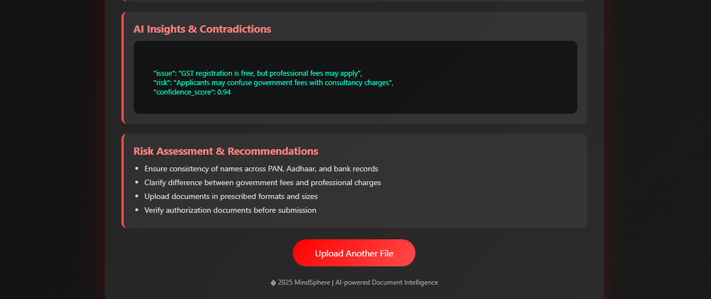

## mindsphere-document-intelligence
AI-powered document intelligence system to detect hidden contradictions in policy documents

*Team:** MindSphere 
*Tagline:** Where Intelligence Meets Innovation 

---

## 📌 Problem Statement?
**PS-2: Document Intelligence with Contradiction Detection*

Large contracts, policy documents, and institutional guidelines often contain **hidden contradictions** due to multiple revisions, complex language, and manual drafting. These contradictions can lead to **compliance issues, legal disputes, and ambiguity**. Manual review is slow, error-prone, and not scalable.

---

## 💡 Solution Overview

**MindSphere** is an **AI-powered document intelligence system** that automatically analyzes large contracts and policy documents to **detect and explain hidden contradictions at the clause level**.

Instead of relying on keyword matching, MindSphere uses **Natural Language Processing (NLP)** and **Natural Language Inference (NLI)** to understand the *semantic meaning* of clauses and identify conflicts such as:
- Obligations vs prohibitions  
- Conflicting timelines  
- Conditional inconsistencies  

The system provides **clear, explainable outputs** that help users quickly understand where and why contradictions occur.

---

## 🎯 Objectives
- Automate analysis of large policy and contract documents  
- Detect semantic contradictions across clauses  
- Provide explainable, human-readable results  
- Reduce manual review time and compliance risks  
- Build a scalable and real-world applicable solution  

---

## ⚙️ Key Features
- Upload policy or contract documents (TXT / PDF*)
- Automatic clause segmentation
- AI-based semantic contradiction detection
- Confidence score for detected contradictions
- Explainable output for better understanding
- Working MVP with live demo capability  

---
##  Screenshots

### Home Screen

### File Upload

### Analysis Result

🧠 **System Architecture (High-Level)**

Document Upload  
⬇️  
Text Extraction / OCR  
⬇️  
Clause Segmentation  
⬇️  
Semantic Understanding (NLP)  
⬇️  
Contradiction Detection (NLI)  
⬇️  
Explainable Output / Dashboard

---

## 🛠️ Tech Stack

### Backend
- **FastAPI (Python)** – REST API backend
- **Transformers (RoBERTa MNLI)** – AI-based contradiction detection

### Frontend
- **HTML, CSS, JavaScript** – Interactive MVP UI

---

## ☁️ Google Technologies Used

> The project is designed to leverage Google technologies end-to-end for scalability and production readiness.

- **Google AI** – Semantic understanding of document clauses  
- **Vertex AI** – Deployment and inference of AI/NLP models  
- **Google Vision OCR** – Text extraction from scanned PDFs  
- **Firebase Authentication** – Secure user access  
- **Firebase Hosting** – Frontend hosting  
- **Firebase Firestore** – Storage of reports and metadata  
- **Gemini API** – Generating human-readable explanations  
- **Google Cloud Storage** – Secure document storage  

---

## 🚀 Minimum Viable Product (MVP)

The MVP demonstrates:
- End-to-end document upload and processing  
- Real-time contradiction detection  
- Explainable AI outputs  
- Clean, animated user interface  
---
## 🎯 Target Users & Use Cases

### ⚖️ Legal Professionals & Law Firms
- Faster, more accurate contract and policy reviews
- Automatic detection of inconsistencies, risks, and missing clauses

### 🛡️ Compliance & Audit Teams
- Early identification of regulatory and policy gaps
- Improved compliance monitoring and audit readiness

### 🏢 Enterprises & Corporates
- Ensures consistency across internal policies and legal documents
- Reduces legal, regulatory, and operational risks

### 🚀 Startups & Small Businesses
- Affordable AI-powered document analysis
- No requirement for legal expertise

### 🏛️ Government & Regulatory Bodies
- Improves clarity, consistency, and transparency in public policies
- Supports regulatory compliance and policy standardization

### 🎓 Students & Researchers
- Useful for legal-tech, NLP, and AI research projects
- Enables experimentation and academic innovation
---
▶️ How to Run the Project Locally

1️⃣ Install dependencies
pip install -r backend/requirements.txt

⬇️

2️⃣ Start the backend server
uvicorn backend.main:app --reload

⬇️

3️⃣ Run the frontend
Open frontend/index.html in a browser.
Upload a sample document
Click Analyze Document
